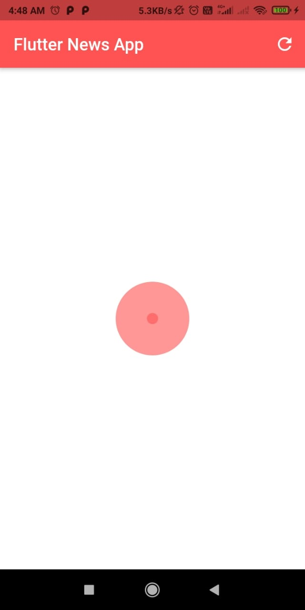
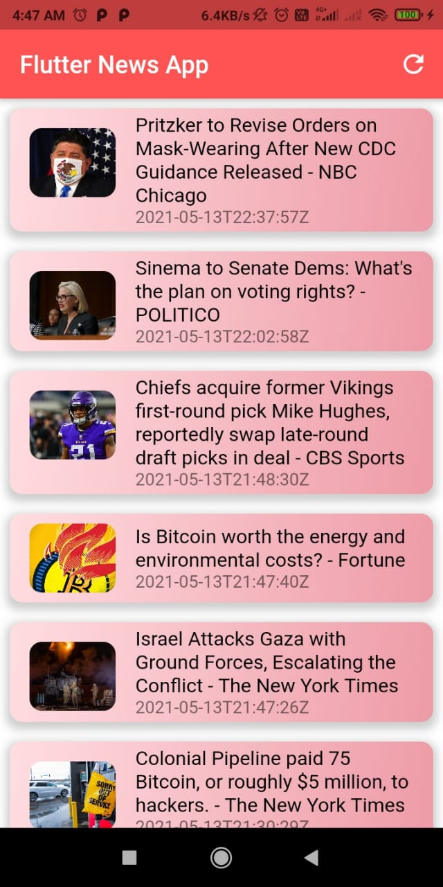
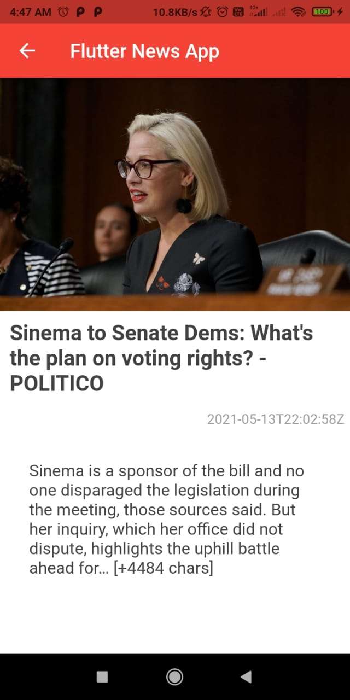
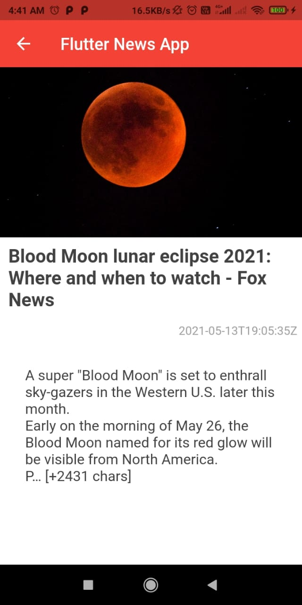

# flutter_newsapp

A News App using [API from newsapi.org](newsapi.org) and using Bloc.

# Working 

### ⚡ Screenshots

<br>
<p align="center">
    </img> =></img>=> </img> 
    </img> 

    
</p>
<br>
<br>

### ⚡ video
<br>
<p align="center">
    </img> 

    
</p>
<br>
<br>


### Before Running
- Replace the <API_KEY> in ```lib/res/strings.dart``` with your own API key generated from [newsapi.org](newsapi.org).

<br>
<br>
<br>
<br>
<br>


